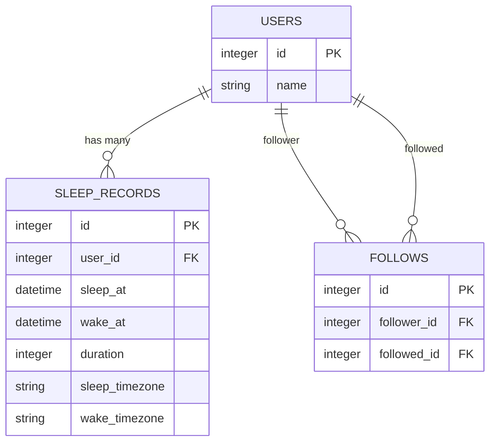

# Good Night API

A Rails API for tracking users' sleep patterns and viewing weekly sleep rankings among followed users.

## 📋 Table of Contents

- [Features](#features)
- [Tech Stack](#tech-stack)
- [Architecture](#architecture)
- [Database Schema](#database-schema)
- [Setup](#setup)
- [Assumptions](#assumptions)
- [API Documentation](#api-documentation)
- [Testing](#testing)
- [Background Jobs](#background-jobs)
- [Scalability & Performance](#scalability--performance)
- [Contributing](#contributing)

---

## ✨ Features

> Users can log when they sleep/wake and compare weekly sleep stats with friends.

- **Sleep Tracking**: Record when users go to bed and wake up using a single `clock_in` endpoint
- **Social Features**: Follow and unfollow other users to build a sleep tracking community
- **Weekly Rankings**: View weekly sleep records of followed users, sorted by total sleep duration
- **Scalable Design**: Built with caching, database indexing, background jobs, and clean architecture patterns
- **Timezone Support**: Handle sleep records across different timezones
- **Pagination**: Efficient data retrieval with built-in pagination support

---

## 🛠 Tech Stack

- **Ruby**: 3.0.0 (see [`.ruby-version`](.ruby-version))
- **Rails**: 7.1.0 (API mode)
- **PostgreSQL**: Primary database with support for complex queries and excellent scalability
- **Redis**: Caching layer for leaderboards and sleep records
- **Sidekiq**: Background job processing with cron scheduling
- **RSpec**: Comprehensive testing framework
- **Docker**: Containerization support

### Key Gems

- **Data & Validation**: `dry-validation`, `dry-monads`, `dry-struct` for robust data handling
- **Serialization**: `alba` for fast JSON serialization
- **Architecture**: `boxenn` for domain-driven design patterns
- **Database**: `scenic` for database views, `pg` for PostgreSQL
- **Background Jobs**: `sidekiq`, `sidekiq-cron` for scheduled tasks

---

## 🏗 Architecture

This application follows **Domain-Driven Design (DDD)** principles with clean architecture:

```
app/
├── api/                     
│   ├── contracts/        # Request validation
│   └── serializers/      # Response serializers
├── controllers/          # API controllers 
├── domains/               # Domain logic (DDD)
│   ├── master_data/       # User management domain
│   ├── relationship/      # Follow/unfollow domain
│   └── track_management/  # Sleep tracking domain
├── models/ 
├── services/             # Application services
│   ├── cache/           # Caching services
│   ├── refresher/       # Data refresh services
│   └── use_cases/       # Business use cases
└── workers/             # Background job workers
```

### Domain Design

The application implements **Domain-Driven Design (DDD)** with three distinct bounded contexts:

#### 1. **Master Data Domain** (`app/domains/master_data/`)
**Responsibility**: Core user management and identity

- **Entities**:
  - [`User`](app/domains/master_data/entities/user.rb): Basic user entity with id and name
- **Repositories**:
  - [`User`](app/domains/master_data/repositories/user.rb): User data access with existence checks
- **Key Features**:
  - User identity management
  - User existence validation
  - Simple user profile data

#### 2. **Relationship Domain** (`app/domains/relationship/`)
**Responsibility**: Social connections and follow relationships

- **Entities**:
  - [`Follow`](app/domains/relationship/entities/follow.rb): Follow relationship with validation (users cannot follow themselves)
- **Repositories**:
  - [`Follow`](app/domains/relationship/repositories/follow.rb): Thread-safe follow operations with advisory locks
- **Key Features**:
  - Follow/unfollow operations
  - Deadlock prevention through consistent lock ordering
  - Self-follow validation
  - User relationship queries

#### 3. **Track Management Domain** (`app/domains/track_management/`)
**Responsibility**: Sleep tracking and analytics

- **Entities**:
  - [`SleepRecord`](app/domains/track_management/entities/sleep_record.rb): Sleep session with timezone support and duration calculation
- **Repositories**:
  - [`SleepRecord`](app/domains/track_management/repositories/sleep_record.rb): Complex sleep record operations with advisory locks
  - [`FollowingsWeeklySleepRanking`](app/domains/track_management/repositories/followings_weekly_sleep_ranking.rb): Weekly ranking calculations
- **Key Features**:
  - Clock-in/clock-out sleep tracking
  - Timezone-aware sleep records
  - Incomplete record handling (sleep without wake)
  - Weekly ranking aggregations
  - Duration calculations

---

## 🗄️ Database Schema

The application uses a simple but effective database schema with three main entities:



### Entity Relationships

- **Users**: Core user entity with basic profile information
- **Follows**: Many-to-many relationship table enabling users to follow each other
- **Sleep Records**: Tracks individual sleep sessions with timezone support and duration calculation

---

## 🚀 Setup

### Prerequisites

- Ruby 3.0.0
- PostgreSQL 12+
- Redis 6+

### Installation

```bash
# Clone repository
git clone https://github.com/Rae-Lee/sleep_tracker_rails.git
cd sleep_tracker_rails

# Install dependencies
bundle install

# Setup database
rails db:create db:migrate db:seed

# Start Redis (if not running)
redis-server

# Start Sidekiq (for background jobs)
bundle exec sidekiq

# Run server
rails server
```

The API will be available at `http://localhost:3000`.

### Docker Setup

```bash
# Build and run with Docker
docker build -t sleep-tracker-api .
docker run -p 3000:3000 sleep-tracker-api
```

---

## 📋 Assumptions

### 1. Clock In / Clock Out Flow

**API Design**: A single `clock_in` API handles both clock-in and clock-out actions.

**Call Sequence**:
- First call → creates a record with `sleep_at` (bedtime).
- Second call → updates the same record with `wake_at` (wake-up time).

**Behavior**:
- No unfinished record → create a new `sleep_at` entry.
- Unfinished record exists → update it with `wake_at`.
- Response: Always returns all user records (including unfinished one).

### 2. Cross-Day and Cross-Week Records

**Cross-day**: Supported (e.g., sleep at 23:00 → wake at 07:00).

**Cross-week**: If a sleep record spans across weeks, it is still included when retrieving the ranking of all followed users for the previous week. The record is assigned to the week based on its `sleep_at` value.

**Example**: Sleep on Sunday 23:00, wake on Monday 07:00 → the record is counted as part of Sunday’s week.

### 3. Timezone Handling

- All timestamps are stored in UTC.
- API responses use ISO8601 format.
- The system supports different timezones for sleep_at and wake_at (e.g., in travel scenarios).

### 4. Follow Logic

- `follows(follower_id, followed_id)` must be unique; duplicate follows are not allowed.

---

## 📚 API Documentation

Base URL: `http://localhost:3000/api/v1`

### Authentication

All endpoints require an `identity_id` parameter to identify the user making the request.

### 1. Sleep Records

#### 1.1 Clock In (Sleep / Wake)

Record sleep or wake time for a user.

**Endpoint**
```http
POST /api/v1/sleep_records/clock_in
```

**Request Body**
```json
{
  "identity_id": 1,
  "sleep_at": "2024-01-15T22:30:00Z",
  "wake_at": "2024-01-16T07:00:00Z",
  "sleep_timezone": "Asia/Taipei",
  "wake_timezone": "Asia/Taipei"
}
```

**Parameters**
- `identity_id` (required): User ID
- `sleep_at` (required): Sleep timestamp in ISO 8601 format
- `wake_at` (optional): Wake timestamp in ISO 8601 format
- `sleep_timezone` (optional): Timezone for sleep time
- `wake_timezone` (optional): Timezone for wake time

**Response**
```json
{
  "user_id": 1,
  "data": [
    {
      "sleep_at": "2025-08-23T22:30:00+00:00",
      "wake_at": "2025-08-24T07:00:00+00:00",
      "sleep_timezone": "Asia/Taipei",
      "wake_timezone": "Asia/Taipei",
      "sleep_at_in_timezone": "2025-08-24T06:30:00+08:00",
      "wake_at_in_timezone": "2025-08-24T15:00:00+08:00",
      "duration": 30600,
      "status": "completed"
    }
  ],
  "pagination": {
    "page": 1,
    "per_page": 10,
    "total_count": 1,
    "total_pages": 1
  }
}
```

### 2. Follow Management

#### 2.1 Follow a User

**Endpoint**
```http
POST /api/v1/follows
```

**Request Body**
```json
{
  "identity_id": 1,
  "followed_id": 2
}
```

**Parameters**
- `identity_id` (required): ID of the user making the follow request
- `followed_id` (required): ID of the user to follow

**Response**
```json
{
  "user_id": 1,
  "data": {  
   "followed_id": 5,
   "followed_name": "Emma Brown",
  }, 
  "created_at": "2024-01-15T10:00:00Z"
}
```

#### 2.2 Unfollow a User

**Endpoint**
```http
DELETE /api/v1/follows/:id
```

**Parameters**
- `identity_id` (required): ID of the user making the unfollow request
- `id` (URL parameter): Follow relationship ID

**Response**
```json
{
  "message": "Successfully unfollowed user"
}
```

### 3. Weekly Sleep Rankings

#### 3.1 Get Weekly Rankings

Retrieve weekly sleep rankings for all followed users.

**Endpoint**
```http
GET /api/v1/followings/sleep_ranking
```

**Query Parameters**
- `identity_id` (required): User ID requesting the rankings
- `page` (optional): Page number (default: 1)
- `per_page` (optional): Records per page (max: 50, default: 20)

**Response**
```json
{
  "user_id": 1,
  "week_start": "2024-01-15",
  "week_end": "2024-01-21",
  "data": [
    {
      "followed_id" : 2,
      "followed_name": "john_doe",
      "sleep_at": "2024-01-15T22:30:00+00:00",
      "wake_at": "2024-01-16T07:00:00+00:00",
      "sleep_timezone": "Asia/Taipei",
      "wake_timezone": "Asia/Taipei",
      "sleep_at_in_timezone": "2024-01-16T06:30:00+08:00",
      "wake_at_in_timezone": "2024-01-16T15:00:00+08:00",
      "duration": 30600,
    }
  ],
  "pagination": {
    "page": 1,
    "per_page": 20,
    "total_count": 5,
    "total_pages": 1
  }
}
```

### Error Responses

All endpoints return consistent error responses:

```json
{
  "error": "Validation failed",
  "errors": {
    "followed_id": ["must be a positive integer"]
  }
}
```

Common HTTP status codes:
- `200`: Success
- `400`: Bad Request
- `404`: Not Found
- `422`: Unprocessable Entity
- `500`: Internal Server Error

---


---

## 🧪 Testing

Run the test suite:

```bash
# Run all tests
bundle exec rspec

# Run specific test file
bundle exec rspec spec/requests/api/v1/sleep_records/clock_ins_spec.rb

# Run tests with coverage
COVERAGE=true bundle exec rspec
```

### Test Structure

- **Request specs**: API endpoint testing
- **Service specs**: Business logic testing
- **Factory specs**: Test data generation
- **Worker specs**: Background job testing

---

## ⚙️ Background Jobs

The application uses Sidekiq for background processing:

### Weekly Sleep Ranking Refresh

Automatically refreshes weekly sleep rankings using database views.

```ruby
# Scheduled via sidekiq-cron
WeeklySleepRankingRefreshWorker.perform_async
```

### Starting Background Workers

```bash
# Start Sidekiq
bundle exec sidekiq

# Start with specific configuration
bundle exec sidekiq -C config/schedule.yml
```

---

## ⚡ Scalability & Performance

The system is designed to efficiently handle a growing user base, managing high data volumes and concurrent requests through multiple optimization strategies:

### 1. Database Indexing

**Strategic Index Placement**:
```sql
-- Composite index for sleep record queries
CREATE INDEX index_track_management_sleep_records_on_user_id_and_sleep_at
ON track_management_sleep_records (user_id, sleep_at);

-- Unique constraint with index for follow relationships
CREATE UNIQUE INDEX idx_on_follower_id_followed_id
ON relationship_follow_records (follower_id, followed_id);

-- Materialized view index for fast ranking queries
CREATE UNIQUE INDEX index_followings_weekly_sleep_rankings_unique
ON track_management_followings_weekly_sleep_rankings (followed_id, sleep_at_utc);
```

**Benefits**:
- **Fast user sleep record lookups** by `user_id` and `sleep_at`
- **Efficient follow relationship queries** with unique constraint enforcement
- **Optimized weekly ranking queries** through materialized view indexing

### 2. Duration Storage Optimization

**Pre-calculated Duration Storage**:
- Sleep duration calculated and stored as integer (seconds) in database
- Eliminates real-time calculation overhead during queries
- Enables efficient sorting and aggregation operations

```ruby
# Duration calculated once during record creation/update
duration = (wake_at.utc - sleep_at.utc).to_i
record.update!(duration: duration)
```

### 3. N+1 Query Prevention

**Eager Loading Strategy**:
```ruby
# Follow repository with user data preloading
def with_users
  source_wrapper.source.includes(:followed)
end

# Materialized view eliminates N+1 for ranking queries
# Single query returns all user data with sleep records joined
```

**Implementation**:
- **Repository pattern** with explicit `includes()` for associations
- **Materialized views** pre-join related data
- **Domain entities** encapsulate data access patterns

### 4. Pagination Implementation

**Consistent Pagination Across All Endpoints**:
```ruby
# Built-in pagination with configurable limits
def find_by_user_id(user_id:, page: 1, per_page: 10)
  records = source_wrapper.source
    .where(user_id: user_id)
    .limit(per_page)
    .offset((page - 1) * per_page)
end

# Validation prevents excessive page sizes
rule(:per_page) do
  key.failure('cannot exceed 50 records per page') if value && value > 50
end
```

**Features**:
- **Maximum page size limits** (50 records) prevent resource exhaustion
- **Offset-based pagination** for consistent results
- **Total count tracking** for client-side pagination controls

### 5. Database Transaction Management

**Advisory Locks for Concurrency Control**:
```ruby
# Prevent race conditions in sleep record operations
def save(primary_keys, attributes)
  user_id = primary_keys[:user_id]
  lock_key = "sleep_record_user_#{user_id}"

  with_advisory_lock(lock_key) do
    # Thread-safe sleep record creation/update logic
  end
end

# Deadlock prevention in follow operations
def generate_lock_key(primary_keys)
  ids = [follower_id, followed_id].sort  # Consistent ordering
  "follow_relationship_#{ids[0]}_#{ids[1]}"
end
```

**Benefits**:
- **Advisory locks** prevent race conditions without table-level locking
- **Consistent lock ordering** prevents deadlocks
- **User-specific locking** allows concurrent operations for different users

### 6. Multi-Layer Caching Strategy

**Redis-Based Caching with Smart Invalidation**:

#### **Sleep Records Cache**:
```ruby
class Cache::SleepRecordCacheService
  CACHE_EXPIRY = 1.hour
  PAGE_SIZE = 10
  
  # User-specific cache keys
  def cache_key
    "sleep_records:user:#{user_id}:page:#{page}"
  end
end
```

#### **Intelligent Followings Cache**:
```ruby
class Cache::FollowingsSleepRecordsCacheService
  CACHE_EXPIRY = 8.days
  HEAVY_USER_THRESHOLD = 20
  
  # Cache only for heavy users (20+ queries)
  def should_cache?
    is_heavy_user? && !cache_exists? && page == 1
  end
  
  # Week-based cache keys for rankings
  def cache_key
    week_key = last_week_key
    "followings_sleep_records:user:#{user_id}:#{week_key}:page:#{page}"
  end
end
```

**Cache Features**:
- **Selective caching**: Only cache for heavy users (20+ queries per week)
- **Automatic invalidation**: Cache cleared on data updates
- **Week-based keys**: Separate cache for different time periods
- **Query counting**: Track user activity to optimize caching decisions

### 7. Background Job Processing

**Sidekiq-Based Async Processing**:

#### **Weekly Ranking Refresh Worker**:
```ruby
class WeeklySleepRankingRefreshWorker
  include Sidekiq::Worker
  sidekiq_options queue: :default, retry: 3
  
  def perform
    # Refresh materialized view
    # Invalidate all caches
    # Pre-warm cache for heavy users
  end
end
```

#### **Scheduled Tasks**:
```yaml
# config/schedule.yml
weekly_ranking_refresh:
  cron: '0 1 * * 1'  # Every Monday at 1 AM
  class: WeeklySleepRankingRefreshWorker
```

**Benefits**:
- **Non-blocking operations**: Heavy computations moved to background
- **Automatic retries**: Failed jobs retry up to 3 times
- **Scheduled maintenance**: Weekly data refresh during low-traffic hours
- **Cache pre-warming**: Proactively cache data for heavy users

### 8. Materialized Views

**Pre-computed Weekly Rankings**:
```sql
CREATE MATERIALIZED VIEW track_management_followings_weekly_sleep_rankings AS
SELECT
  sr.user_id AS followed_id,
  u.name AS followed_name,
  sr.sleep_at AS sleep_at_utc,
  sr.wake_at AS wake_at_utc,
  sr.sleep_at AT TIME ZONE sr.sleep_timezone AS sleep_at_local,
  sr.wake_at AT TIME ZONE sr.wake_timezone AS wake_at_local,
  sr.sleep_timezone,
  sr.wake_timezone,
  sr.duration
FROM track_management_sleep_records sr
JOIN master_data_users u ON u.id = sr.user_id
WHERE
  (sr.sleep_at AT TIME ZONE sr.sleep_timezone) >= date_trunc('week', NOW() AT TIME ZONE sr.sleep_timezone) - INTERVAL '1 week'
  AND (sr.sleep_at AT TIME ZONE sr.sleep_timezone) < date_trunc('week', NOW() AT TIME ZONE sr.sleep_timezone)
  AND sr.wake_at IS NOT NULL
ORDER BY sr.duration DESC;
```

**Advantages**:
- **Pre-computed joins**: Eliminates expensive JOIN operations at query time
- **Timezone calculations**: Complex timezone conversions done once during refresh
- **Filtered data**: Only includes relevant records (previous week, completed sleep sessions)
- **Sorted results**: Pre-sorted by duration for fast ranking queries

### Monitoring & Scaling

**Key Metrics to Monitor**:
- Cache hit/miss ratios
- Database query execution times
- Background job queue lengths
- Materialized view refresh duration
- Advisory lock wait times

---

## 🤝 Contributing

1. Fork the repository
2. Create a feature branch (`git checkout -b feature/amazing-feature`)
3. Commit your changes (`git commit -m 'Add amazing feature'`)
4. Push to the branch (`git push origin feature/amazing-feature`)
5. Open a Pull Request

### Development Guidelines

- Follow Ruby style guide
- Write comprehensive tests for new features
- Update documentation for API changes
- Use conventional commit messages

---

## 📄 License

This project is licensed under the MIT License.

---

## 🔗 Related Documentation
- [DDD Inplement With Boxenn](docs/domain_driven_design_inplement.md)
- [Weekly Sleep Ranking Refresh Process](docs/weekly_sleep_ranking_refresh.md)
- [API Contracts Documentation](app/api/contracts/)
- [Domain Architecture](app/domains/)
